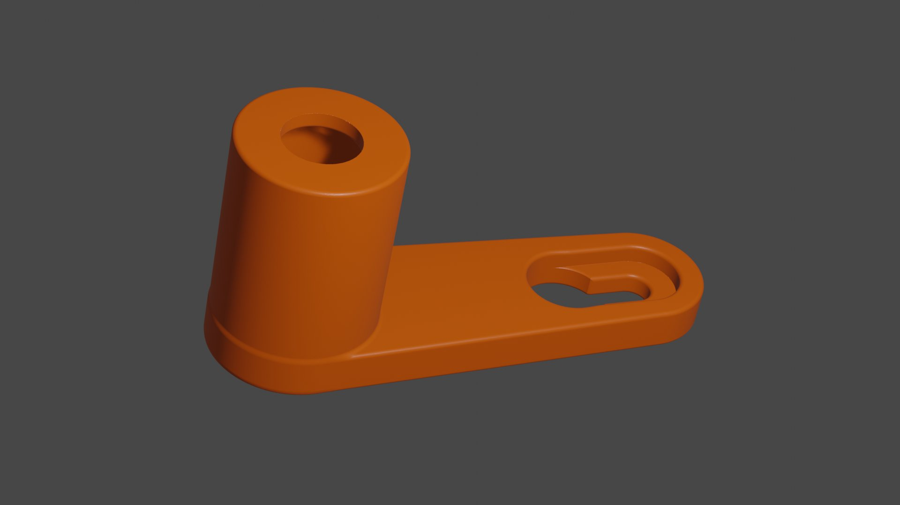

# IKEA Eneby wall mount

[![CC BY-NC-SA 4.0][cc-by-nc-sa-shield]][cc-by-nc-sa]

[cc-by-nc-sa]: http://creativecommons.org/licenses/by-nc-sa/4.0/
[cc-by-nc-sa-shield]: https://img.shields.io/badge/License-CC%20BY--NC--SA%204.0-lightgrey.svg

IKEA's Eneby 20 and Eneby 30 speakers are good sounding piece of stylish kit. Unfortunately while the 20 cm speakers themselves are still available, the wall mount and stand are sold separately and no longer available from IKEA.  Thankfully both the Eneby 20 and Eneby 30 speakers have standard M8x1.25 threaded holes.

## Building this project

This project is written in an OpenSCAD-compatible language and can be built with either [OpenSCAD](http://openscad.org/) or [ImplicitCAD](https://implicitcad.org/).

To generate an STL rendered from the source run `make build/standoff.stl` (with GNU Make).  This will render the STL with ImplicitCAD.  Running `make` with no arguments will build the STL as well as a MeshLab project with models for the fastening hardware to verify fit.

*However* I've sourced the 3D models for the hardware from [McMaster-Carr](https://www.mcmaster.com/cad-models/cad-models/).  While McMaster-Carr has 3D models for all sorts of hardware they are not licensed for redistribution.  Additionally McMaster does not provide models in STL format.  To build the MeshLab project:
* Download the hardware models in your preferred format
* Convert the models to STL (or any format that MeshLab is compatible with)
* Place the models in the `assets` directory
* Finally, run `make`

Fastening hardware:
* McMaster [97151A106](https://www.mcmaster.com/97151A106/) (#8 wood screw)
* McMaster [91290A432](https://www.mcmaster.com/91290A432/) (M8 socket head screw)

## Caveats

The hardware used above was purely for visualization. Use some common sense when mounting anything on your wall.  A wood screw may be the wrong fastener and using anchors is probably a good idea.
